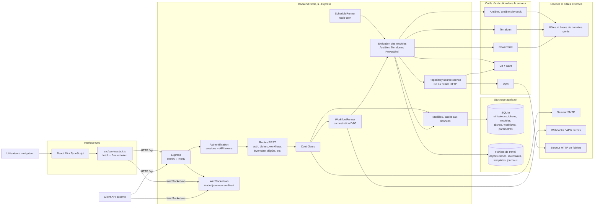
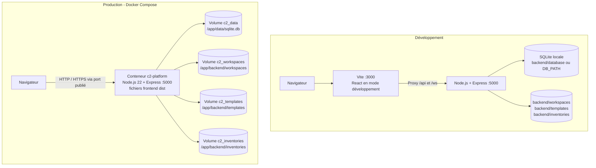
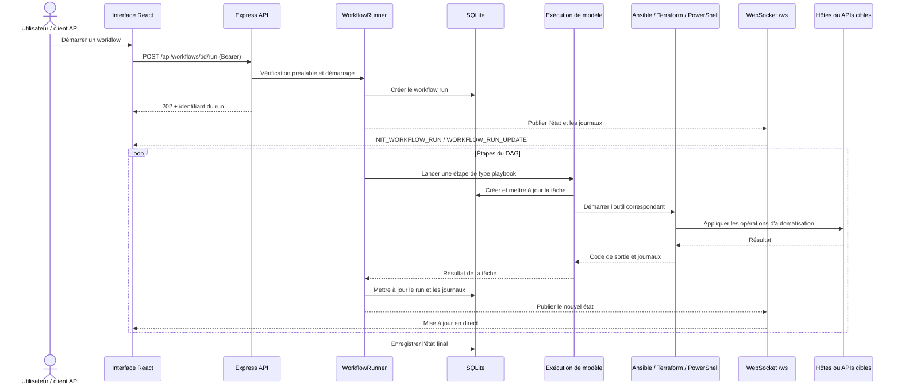

# Architecture de l'application

## 1. Vue d'ensemble

Automaton Platform est une application web composée d'une interface React/TypeScript et d'un backend Node.js/Express. En développement, Vite sert l'interface sur le port `3000` et relaie `/api` et `/ws` vers le backend sur le port `5000`. En production, Express sert les fichiers React compilés (`dist`) et les points d'accès API depuis le même processus.

Le backend utilise SQLite pour ses données applicatives. Les exécutions d'automatisation sont lancées côté serveur : Ansible, Terraform ou PowerShell, selon le type de modèle. Les tâches, workflows, horaires, dépôts, environnements et secrets sont administrés par l'interface ou par les API.

## 2. Diagramme des composants

## 3. Diagramme de déploiement

En production, le Dockerfile construit d'abord le frontend puis l'intègre à l'image d'exécution. L'image contient Node.js, Ansible et ses collections, Terraform, PowerShell, Git et le client SSH. Docker Compose publie le port `5000`, configure un health check sur `/api/health` et monte des volumes persistants pour la base et les fichiers de travail.
## 4. Flux d'exécution d'un workflow

Les étapes possibles d'un workflow incluent l'exécution d'un playbook, une approbation, un email ou un webhook. Une étape d'approbation suspend le workflow jusqu'à la décision d'un client autorisé. `ScheduleRunner` utilise `node-cron` pour démarrer des modèles selon les horaires configurés.

## 5. Responsabilités des blocs

| Bloc | Responsabilité |
| --- | --- |
| Interface React | Pages dashboard, dépôts, inventaires, identifiants, modèles, tâches, workflows et administration. |
| `src/services/api.ts` | Appels HTTP `/api`, ajout du jeton Bearer et gestion des erreurs HTTP. |
| Express et routes | Exposition des API REST, de `/api/health` et du WebSocket `/ws`. Les routes d'authentification et de webhooks publics sont enregistrées avant le middleware d'authentification général. |
| Contrôleurs | Validation et orchestration des opérations applicatives. |
| Modèles | Lecture/écriture des entités dans SQLite. |
| `WorkflowRunner` | Prévalidation, exécution du DAG, branchement succès/échec, approbations et diffusion des événements. |
| `ScheduleRunner` | Enregistrement et déclenchement périodique des tâches avec `node-cron`. |
| Contrôleur de templates | Préparation des variables et secrets, workspace d'exécution et lancement du moteur choisi. |
| Service de sources repository | Clone le dépôt Git sur la branche configurée ou télécharge un fichier HTTP dans le workspace de tâche avec `wget` (repli sur `fetch` en développement). |
| SQLite et fichiers | Persistance des entités en base et des artefacts/résultats dans les répertoires de travail. |

## 6. Données et sécurité

Les principales tables créées au démarrage sont `users`, `repositories`, `tokens`, `environments`, `credentials`, `inventories`, `templates`, `tasks`, `schedules`, `runtime_settings`, `workflow_runs`, `pending_requests`, `database_types`, `workflows` et `mail_settings`.

Un repository est de type Git ou HTTP. Le Sync clone la branche Git ou télécharge le fichier pour vérifier sa disponibilité. Chaque tâche récupère ensuite sa propre copie dans son workspace; les sources HTTP doivent être des URL HTTP(S) sans identifiants intégrés.

L'interface transmet son jeton dans l'en-tête `Authorization: Bearer`. Les sessions de connexion sont stockées dans une `Map` en mémoire dans le processus backend ; les API tokens sont persistés dans SQLite et contrôlés selon leurs scopes. Les secrets d'environnement sont ajoutés au contexte d'exécution côté backend et les fichiers temporaires de variables/identifiants sont créés avec des permissions restreintes.

À représenter comme limites de confiance dans un diagramme de sécurité :

- Le navigateur et les clients API sont externes au backend.
- Les webhooks sous `/api/v1/webhooks` sont publics selon le montage des routes actuel.
- L'accès aux cibles d'automatisation et au serveur SMTP est sortant depuis le backend.
- Les données et artefacts restent locaux au conteneur, sauf volumes Docker montés.

## 7. Notes de périmètre

- Le runtime observé utilise `node:sqlite` dans `backend/config/db.js` et SQLite configuré par `DB_PATH`.
- `backend/prisma/schema.prisma` déclare PostgreSQL, mais il ne correspond pas au chemin d'initialisation utilisé par le serveur décrit ici. Ne pas représenter PostgreSQL/Prisma comme une dépendance active du déploiement sans changement de code/configuration.
- La limite entre frontend et backend est un découpage logique en développement ; le déploiement Docker actuel les regroupe dans un seul conteneur et un processus backend.